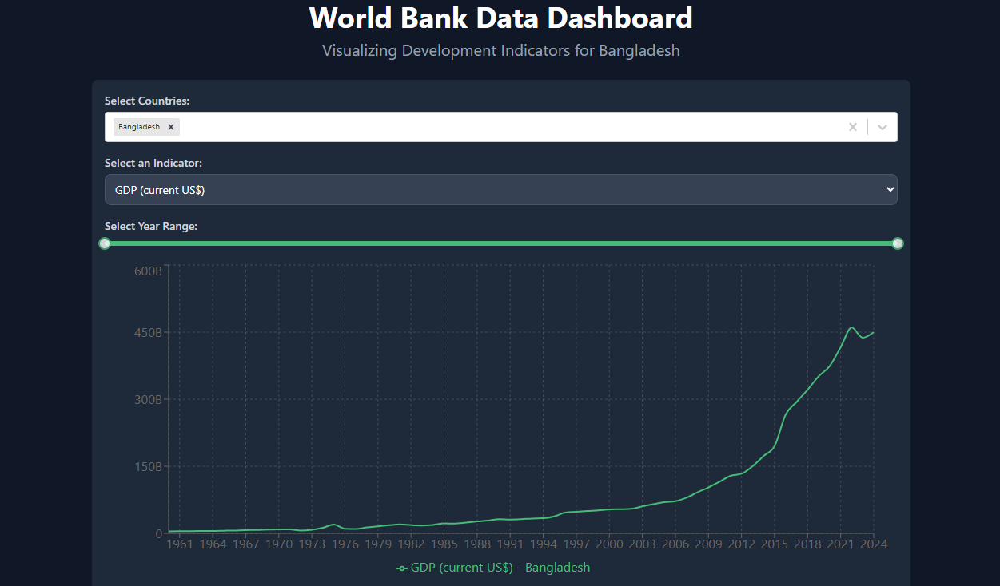
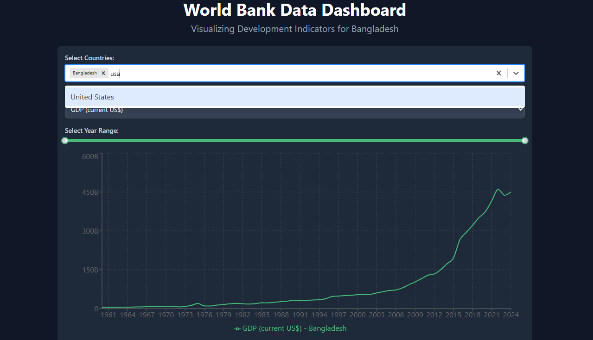
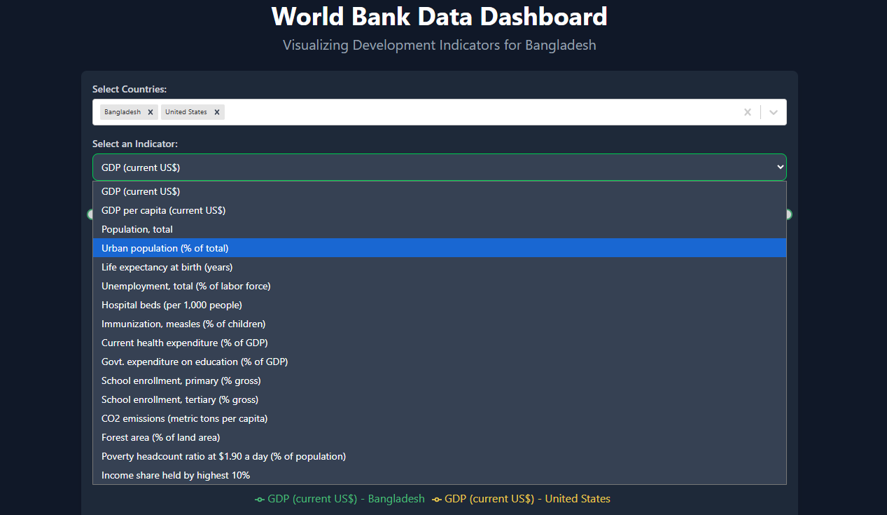
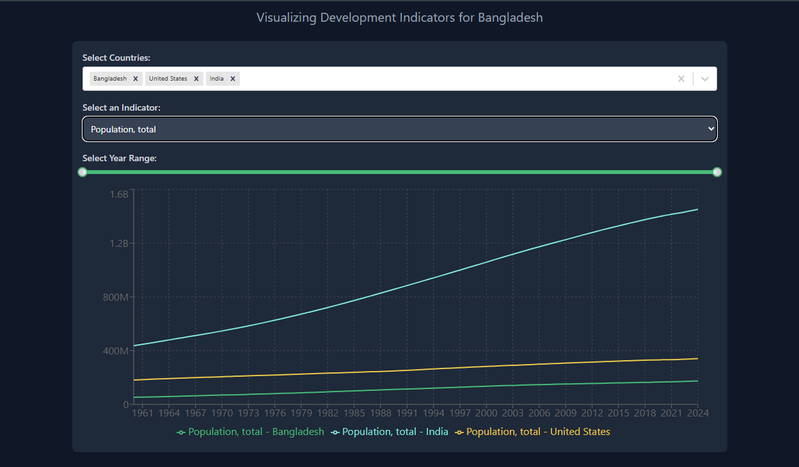
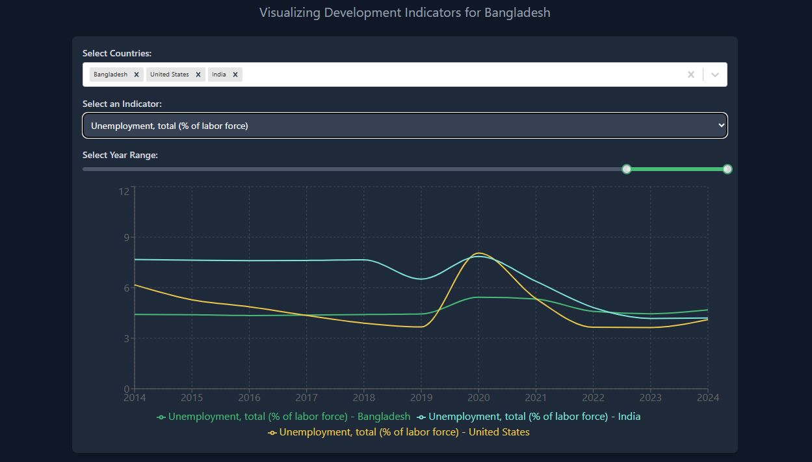
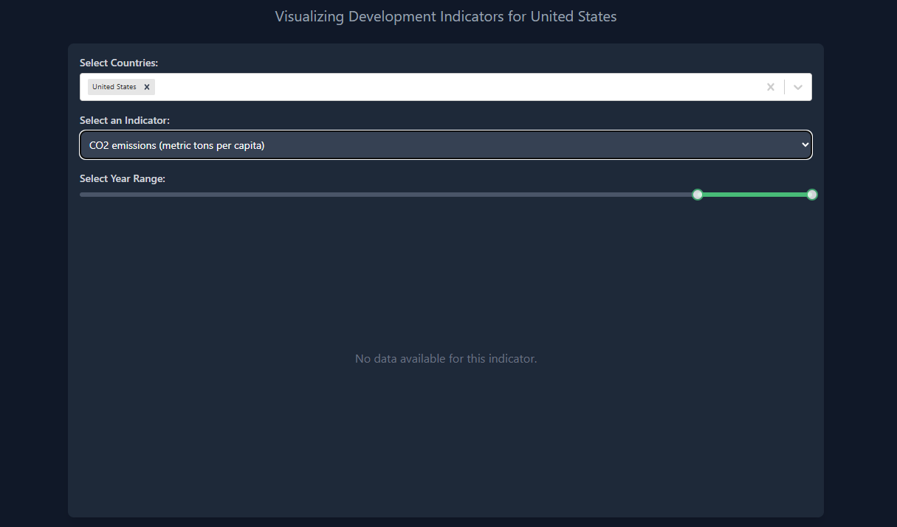
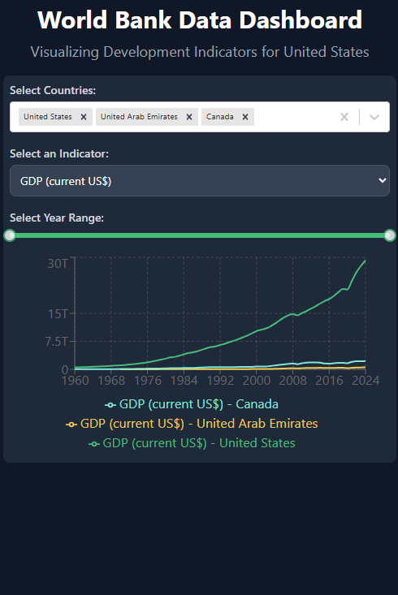

# Globe Analytics- World Bank Data Dashboard

## Overview

The **Globe Analytics- World Bank Data Dashboard** is a React-based web application that visualizes development indicators from the World Bank API. Users can explore and compare economic, demographic, health, education, environmental, and poverty-related metrics across multiple countries with customizable time ranges. This project showcases skills in React, data visualization, API integration, and responsive design, making it a standout portfolio piece.

## Features

- **Interactive Data Visualization**: Line charts for indicators like GDP, population, and CO2 emissions using Recharts.
- **Multi-Country Comparison**: Compare data for multiple countries simultaneously.
- **Customizable Time Range**: Adjust years (1960–2024) to focus on specific periods.
- **Dynamic Indicator Selection**: Choose from a wide range of World Bank indicators.
- **Responsive Design**: Optimized for desktop and mobile with Tailwind CSS.
- **Error Handling**: Displays feedback for loading, errors, and missing data.

## Tech Stack

- **Frontend**: React, React Query (TanStack), Recharts, React-Select, rc-slider
- **Styling**: Tailwind CSS
- **Data**: World Bank API
- **Build Tool**: Vite

## Project Structure

- 

## Installation & Setup

1. **Clone the Repository**:
   ```bash
   git clone https://github.com/khadija-T/world-bank-data-dashboard.git
   cd world-bank-data-dashboard
   ```
2. **Install dependencies**:
   ```bash
   npm install
   ```
3. **Run the development server**:
   ```bash
   npm run dev
   ```
   open http://localhost:5173 in your browser to view the app

## Live link

[Globe Analytics](https://world-bank-data-dashboard.vercel.app/)

## Development Flow

- **Data Fetching**: The useWorldBankData hook uses React Query to fetch data based on selected countries, indicators, and years.
- **State Management**: React state manages selections and triggers re-renders.
- **Data Processing**: The DataChart component aligns multi-country data for visualization.
- **Rendering**: Recharts renders the chart, with Tailwind CSS ensuring responsiveness.
- **Error Handling**: The app handles loading, errors, and no-data cases gracefully.

## Screenshots

- 

- 

- 

- 

- 

- 

- 

## Contributing

This is a personal project, but contributions are welcome! Fork the repo and submit pull requests with detailed changes.

## Future Improvements

- **Data Validation**: Filter indicators by available data.
- **Export Functionality**: Add chart download options.
- **Advanced Visualizations**: Include bar charts or heatmaps.

## Contact

- **GitHub**: [khadija-T](https://github.com/khadija-T)
- **Email**: [khadija.t20037@gmail.com](mailto:khadija.t20037@gmail.com)
- **LinkedIn**: [Khadijatull Kobra](https://www.linkedin.com/in/khadijatull-kobra-80b1a9348)
